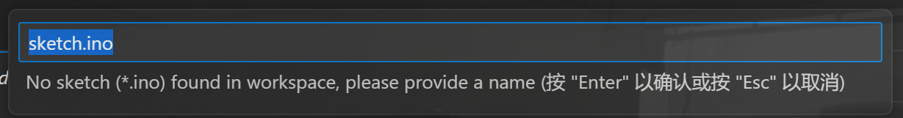
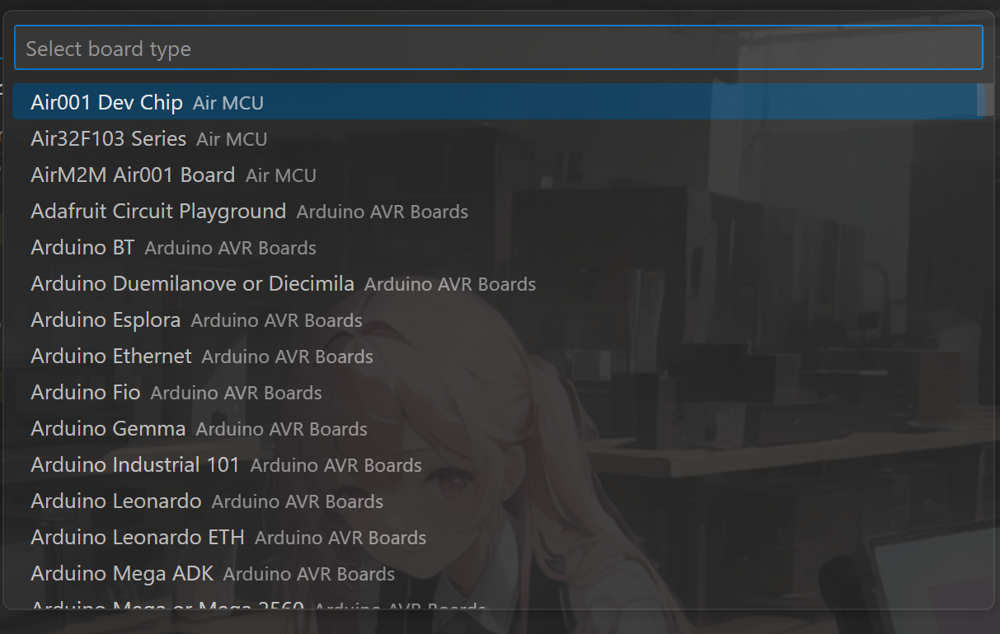
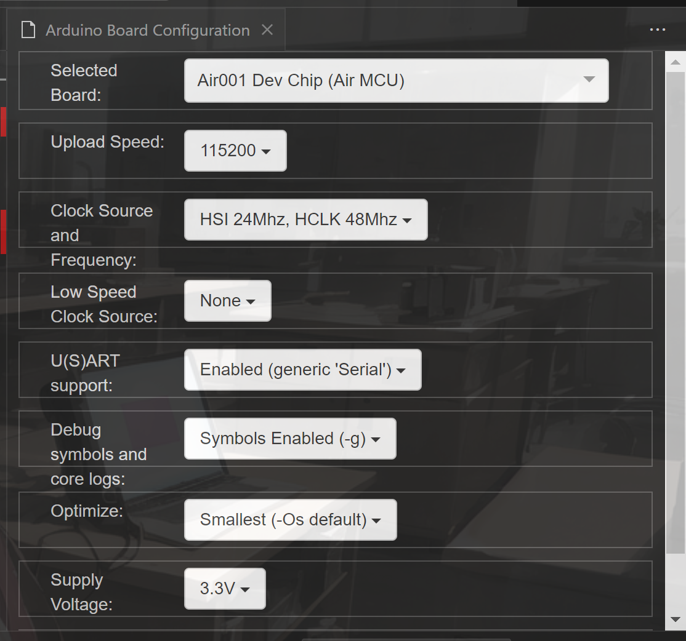
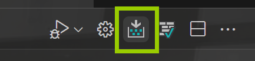
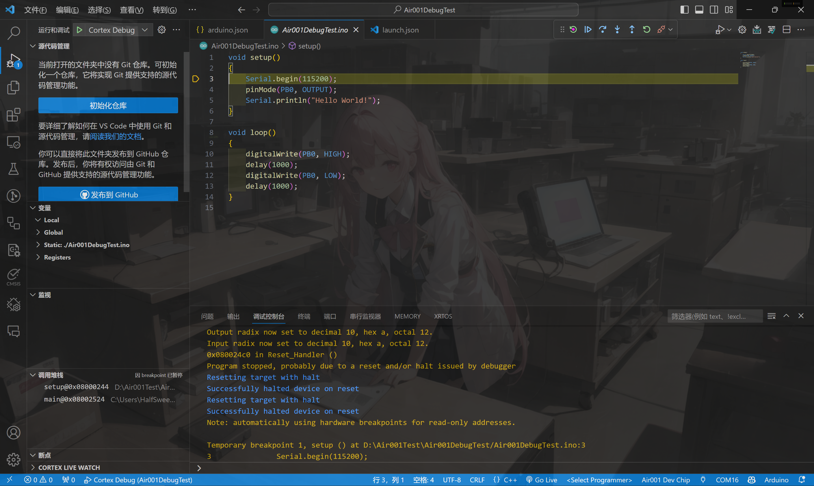

## 使用 VSCode 的`Crotex-Debug`插件

### 先决条件

- 安装 VSCode
- 有一个支持的调试器，可以是 JLink，ST-Link，CMSIS-DAP 等，这里我们使用 DAPLink 作为例子
- 安装 AirMCU 的 SDK
- 安装`PyOCD`

### VSCode 的配置

#### 安装插件

在 VSCode 的插件市场中搜索`Cortex-Debug`，或者在<https://marketplace.visualstudio.com/items?itemName=marus25.cortex-debug>安装即可。

同样，搜索 [`Arduino`](https://marketplace.visualstudio.com/items?itemName=vsciot-vscode.vscode-arduino)，安装`Arduino`插件。

#### 安装 PyOCD

安装 PyOCD 比较简单，在拥有 Python 环境的情况下，直接输入

```bash
pip install --pre -U git+https://github.com/pyocd/pyOCD.git@develop
```

命令安装最新版的 develop 分支的即可。

#### 建立工程

不管是新建一个工程还是用之前老的工程都行，这里我们以新建工程为例。

点击`F1`按钮，输入`Arduino: Initialize`



这里输入文件名，需要注意的是，这个文件名必须和父目录的名字一样，我们这里就修改为`Air001DebugTest.ino`。



芯片型号我们以`Air001 Dev Chip`为例。

建立完成之后，我们随便写一些测试代码，例如：

```cpp
void setup()
{
    Serial.begin(115200);
    pinMode(PB0, OUTPUT);
    Serial.println("Hello World!");
}

void loop()
{
    digitalWrite(PB0, HIGH);
    delay(1000);
    digitalWrite(PB0, LOW);
    delay(1000);
}
```

对于 Arduino Board Configuration，我们选择如下的配置：



切记，Debug symbols and logs 选项中一定要选择有带`-g`的选项，这样才能生成调试符号。

#### 调试配置

在自动生成的`.vscode/arduino.json`文件中，我们需要添加一个属性`output`，这样才能获得编译出来的文件，一个典型的配置如下：

```json
{
    "sketch": "Air001DebugTest.ino",
    "configuration": "UploadSpeed=115200,ClockSourceAndFrequency=HSI24M_HCLK48M,LowSpeedClockSource=None,xserial=generic,dbg=enable_sym,opt=osstd,SupplyVoltage=3V3,BootConnection=defaule",
    "board": "AirM2M:AirMCU:Air001Dev",
    "output": "build"
}
```

然后，我们点击上方的`Upload`按钮，编译并上传代码。



接下来，我们需要配置调试器，点击`F1`按钮，输入`Debug: Add uration`，然后选择`Cortex-Debug`。

这样，在`.vscode`文件夹下就会自动生成一个`launch.json`文件。
01. 我们需要修改其中的`serverpath`属性为`pyocd`
2.  添加一个`armToolchainPath`属性，该属性的含义是一个`arm-none-eabi-gcc`套件的地址，需要注意的是其中需要包含 gbd，我们这里可以直接使用 AirMCU sdk 自带的，
3.  添加`targetId`属性，属性的值为 pyocd 的 target 的 Part Number，我们这里使用`Air001`。
4.  修改`executable`属性，属性的值为编译出来的 elf 文件的地址，我们这里使用`${workspaceRoot}/build/Air001DebugTest.ino.elf`。
5.  修改`runToEntryPoint`属性，该属性为调试时自动运行到入口点，我们这里设置为`setup`。

最后，我们点击 vscode 左边的`运行与调试`图标，或者是直接按`F5`，就可以开始调试了。



享受调试的乐趣吧！
