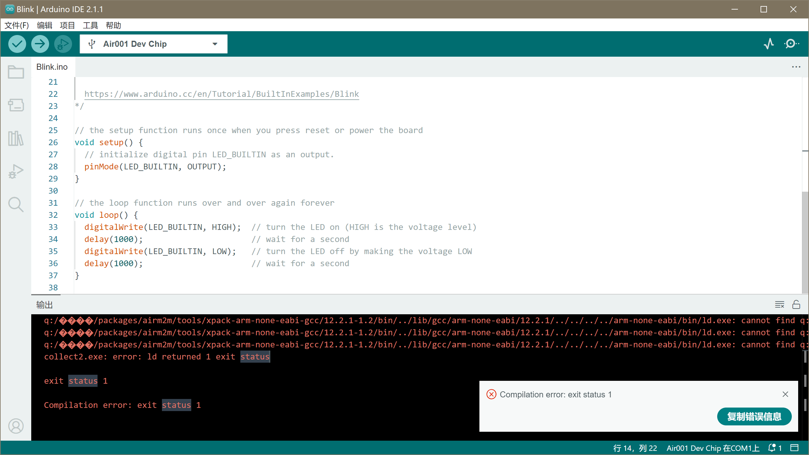

## 问题描述

在编译项目时，链接(ld)阶段报错，并且报错信息的路径包含乱码，实际应为中文路径名，如下图所示：



## 问题原因

GCC编译器不支持使用中文路径，需要将此包放置到英文路径下

## 解决方案

:::warning

开始之前，你需要确保 Arduino IED 处于关闭状态。

:::

### 新建一个不带中文路径的文件夹

首先，新建一个你需要放置文件的文件夹路径，并且保证路径纯英文，不包含空格。  
如：`D:\arduino_pack`。

:::tip

我们下面将默认你的新文件夹路径为`D:\arduino_pack`。

:::

### 迁移当前的包文件

打开文件管理器，在文件路径栏中输入`C:\Users\%USERNAME%\AppData\Local\Arduino15`，回车。

.png)

全选这里的所有文件，将他们全部移动到你最开始新建的文件夹，比如我们这里举例的：

.png)

### 更改配置文件中的包文件路径

打开文件管理器，在文件路径栏中输入`C:\Users\%USERNAME%\.arduinoIDE`，回车。

打开`arduino-cli.yaml`，可以看到当前的配置：

```yaml {4-6}
...
directories:
  builtin:
    libraries: C:\Users\测试\AppData\Local\Arduino15\libraries
  data: c:\Users\测试\AppData\Local\Arduino15
  downloads: C:\Users\测试\AppData\Local\Arduino15\staging
  user: c:\Users\测试\Documents\Arduino
...
```

我们将`C:\Users\测试\AppData\Local\Arduino15`全部替换成新建的文件夹路径即可：

```yaml {4-6}
...
directories:
  builtin:
    libraries: D:\arduino_pack\libraries
  data: D:\arduino_pack
  downloads: D:\arduino_pack\staging
  user: c:\Users\测试\Documents\Arduino
...
```

修改完后，保存配置，即可正常编译。

:::tip

你需要保证项目文件的路径也不能包含中文或空格

:::

## 使用

重新打开 Arduino IED 即可正常编译。

:::tip 如果依旧报错

若你的用户名文件夹为中文，则可能依旧报错，此时需要更改你的`TEMP`环境变量路径。

首先，新建一个你需要放置`TEMP`的文件夹路径，并且保证路径纯英文，不包含空格。  
如：`D:\TEMP`。

将你的环境变量的`TEMP`与`TMP`值改为你新建的文件夹路径即可，可以参考[这篇文章](https://zhuanlan.zhihu.com/p/625914310)。

修改后重新启动 Arduino IED 即可正常编译。

:::
