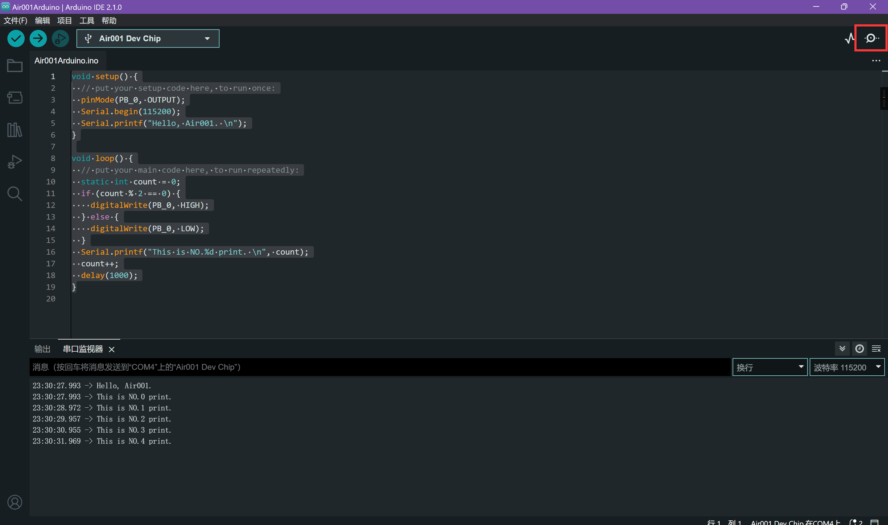

## 连上开发板

使用串口连接上板子USB另一头的串口引脚，具体可以参考：[使用串口下载](https://wiki.luatos.com/chips/air001/mcu.html#id4)

:::details 如果购买了合宙的DAPLink调试器

如果是购买的小白板和合宙的DAPLink调试器，可以直接通过排针排母相连，方向如图所示


:::

连接后，保证开发板有供电，开发板选择AirMCU-Air001 Board，端口选择连接的串口

## 添加代码

在主函数中添加一些测试代码

```cpp title="Air001Arduino.ino"
void setup() {
  // put your setup code here, to run once:
  pinMode(PB_0, OUTPUT);
  Serial.begin(115200);
  Serial.printf("Hello, Air001. \n");
}

void loop() {
  // put your main code here, to run repeatedly:
  static int count = 0;
  if (count % 2 == 0) {
    digitalWrite(PB_0, HIGH);
  } else {
    digitalWrite(PB_0, LOW);
  }
  Serial.printf("This is NO.%d print. \n", count);
  count++;
  delay(1000);
}
```

## 编译下载

点击**上传**按钮，等待编译并上传测试代码


## 查看串口输出

如果代码编译上传正常，那么打开串口监视器，即可看到输出的相关日志



并可观察到LED以1秒的间隔闪烁

---

接下来可以继续查看`应用示例`，测试更多的例子
