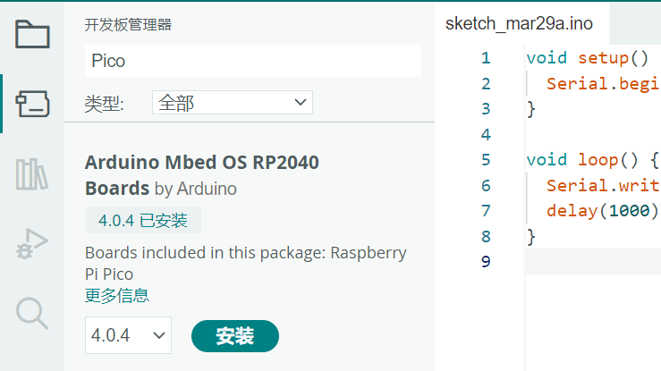
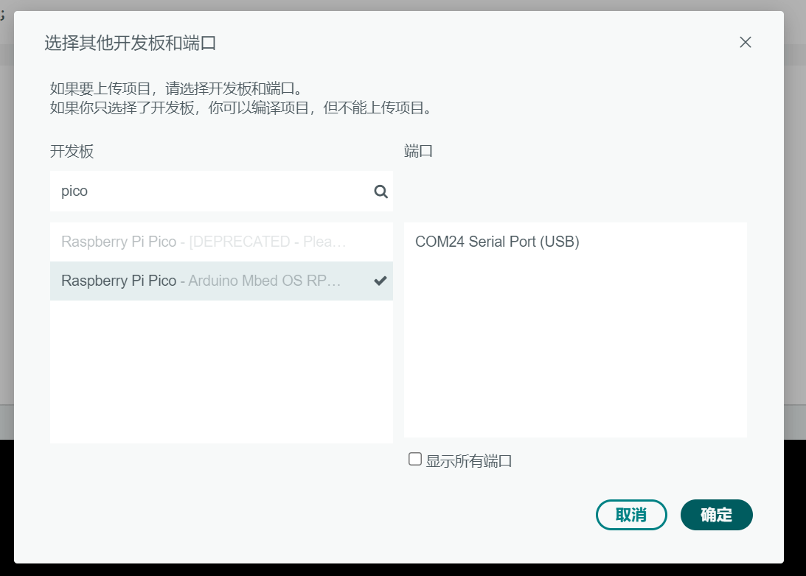
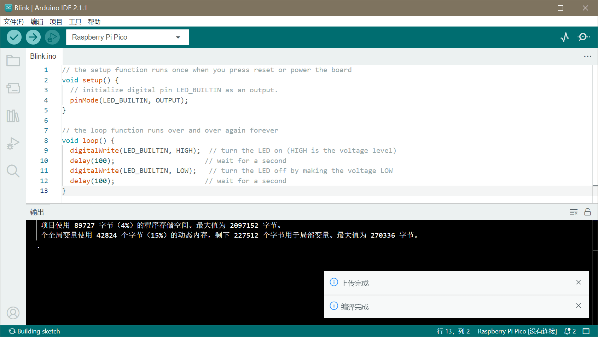

本文将演示如何为[合宙RP2040开发板](https://wiki.luatos.com/chips/rp2040/index.html)进行配置与上手。

## 安装开发板

在**开发板管理器**中搜索**Pico**



安装`Arduino Mbed OS RP2040 Boards`最新版即可

:::tip

安装过程需要安装多个工具链，可能会稍慢，请耐心等待  
中途会安装驱动，请全部点击`安装`

:::

## 选择开发板

开发板选择`选择其他开发板和端口`，在`开发板`中搜索`pico`，选择`Raspberry Pi Pico`：



## 添加代码

在主函数中添加一些测试代码：

```cpp title="PicoArduino.ino"
// the setup function runs once when you press reset or power the board
void setup() {
  // initialize digital pin LED_BUILTIN as an output.
  pinMode(LED_BUILTIN, OUTPUT);
}

// the loop function runs over and over again forever
void loop() {
  digitalWrite(LED_BUILTIN, HIGH);  // turn the LED on (HIGH is the voltage level)
  delay(100);                      // wait for a second
  digitalWrite(LED_BUILTIN, LOW);   // turn the LED off by making the voltage LOW
  delay(100);                      // wait for a second
}
```

## 编译下载

将开发板的 USB 连接移除，**按住**开发板上的按键，再重新插入 USB 接口。

此时电脑会识别到一个名为`RPI-RP2`的U盘设备，说明进入烧录模式成功。

点击**上传**按钮，等待编译并上传测试代码



## 查看效果

如果代码编译上传正常，那么可观察到LED在十分快速地闪烁。

---

接下来可以继续查看`应用示例`，测试更多的例子
