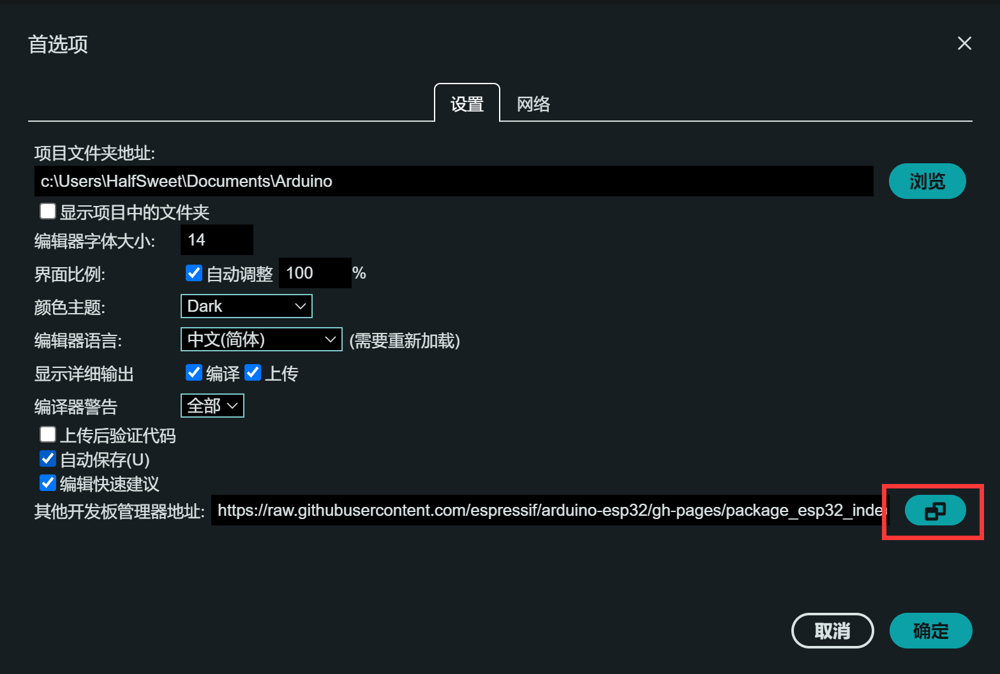
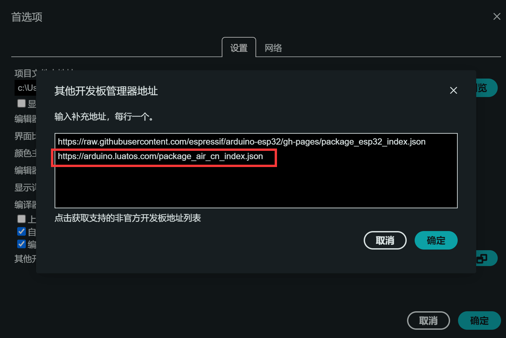

# 🚞 安装 AirMCU 包

## 添加开发板地址

点击Arduino IDE左上角的**文件**-**首选项**


在**其它开发板管理器地址**中输入AirMCU的地址：

```log
https://arduino.luatos.com/package_air_cn_index.json
```

:::tip

海外用户可以使用这个：

```log
https://github.com/Air-duino/Arduino-pack-json-ci/releases/download/Nightly/package_air_index.json
```

:::





## 安装开发板

在**开发板管理器**中搜索**Air MCU**


安装最新版即可

:::tip

安装过程需要安装多个工具链，可能会稍慢，请耐心等待

:::

---

接下来可以继续查看下一章节，进行开发测试
