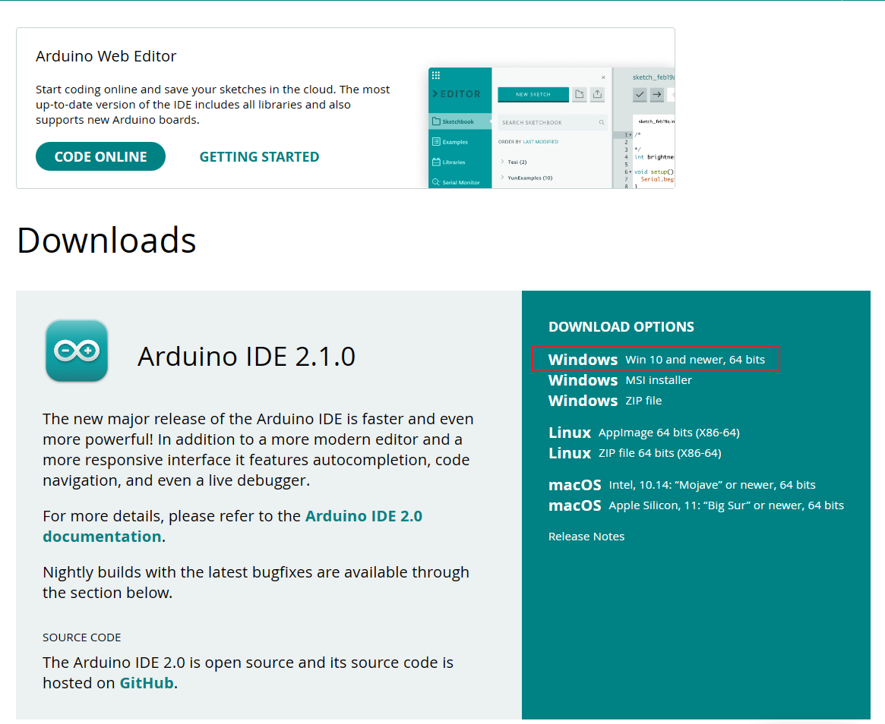
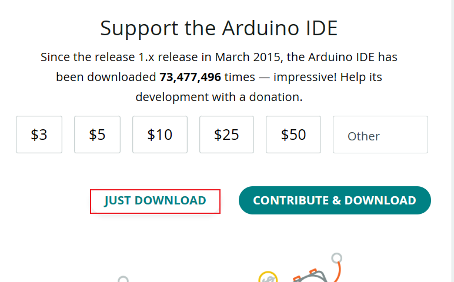
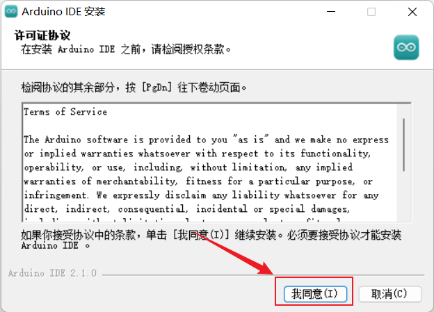
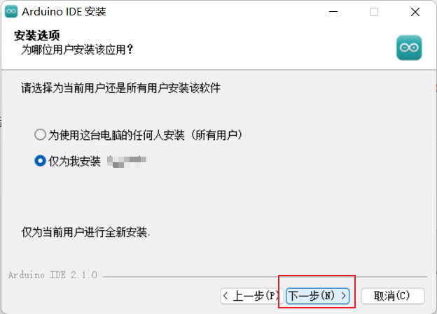
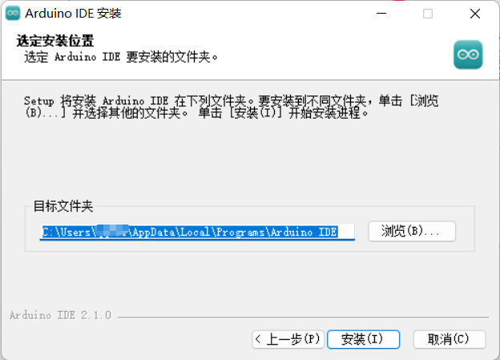
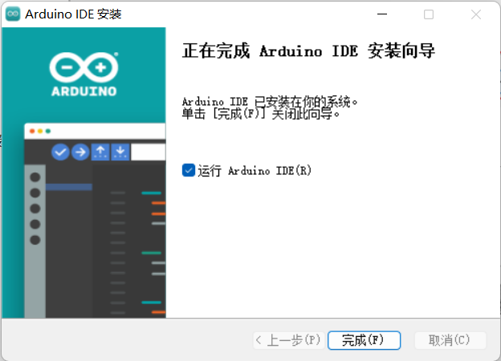
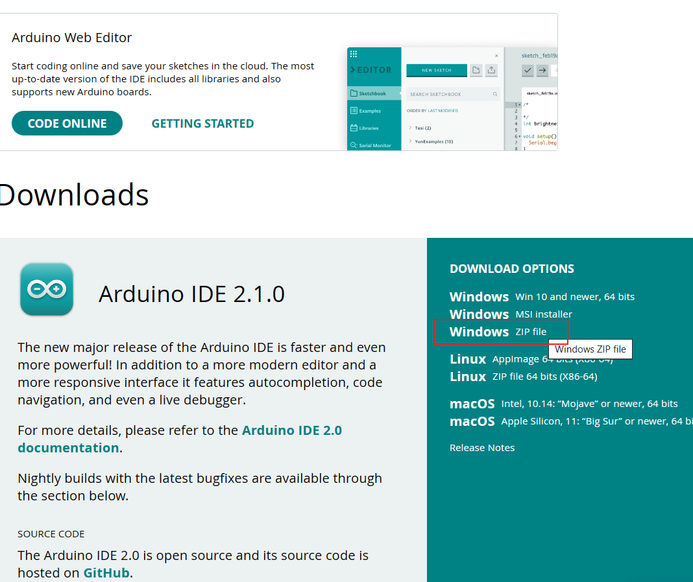
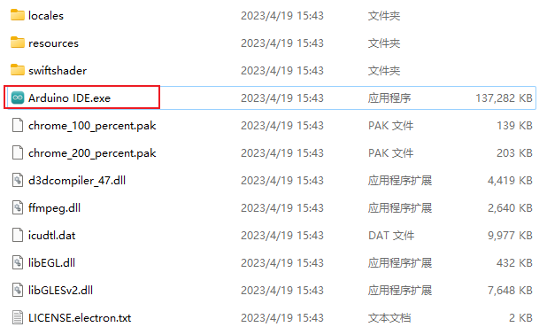
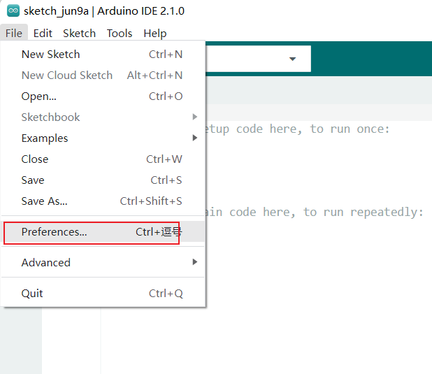
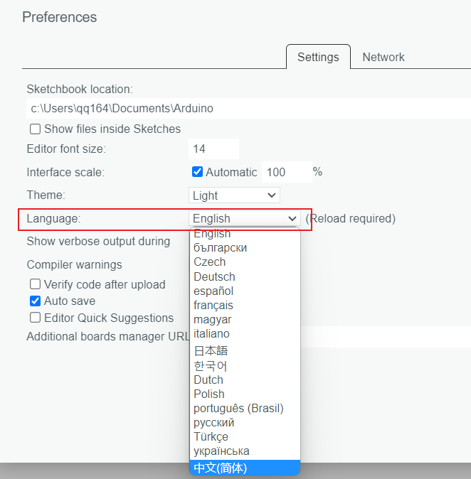

# Arduino IDE安装

Arduino IDE支持Windows、Mac OS X及Linux等平台，下载地址为[Software | Arduino](https://www.arduino.cc/en/software)，本文仅介绍windows下的安装方式，其他系统大同小异，请读者自行研究。

Windows系统下的IDE有EXE安装版和ZIP压缩包免安装版。EXE安装版需要按步骤安装，ZIP压缩包免安装版解压后即可使用（但不会在桌面建立IDE启动图标），后者无须管理员权限也可运行使用。接下来针对两种方式分别介绍如何安装。

## windows下exe版本安装

在[Software | Arduino](https://www.arduino.cc/en/software)可以获取最新的IDE目前版本是2.10，点击如图所示的区域，下载exe版本安装包。

`注：现在大部分电脑都是64位因此可以直接下载最新版本，对于32位的电脑可以在页面下翻，选择老版本进行下载安装。`

选择**`JUST DOWNLOAD`**仅下载，根据网速等待片刻即可下载完成。

双击安装包进行安装，点击我同意。

仅为自己安装即可。

默认安装位置不用动，直接点击安装，稍等一会就可以安装好了。

最后点击完成即可。

## windows下zip版本安装

在[Software | Arduino](https://www.arduino.cc/en/software)可以获取最新的IDE目前版本是2.10，点击如图所示的区域，下载zip版本免安装包。

`注：现在大部分电脑都是64位因此可以直接下载最新版本，对于32位的电脑可以在页面下翻，选择老版本进行下载安装。`

下载完成以后直接解压即可，双击解压后的文件夹中的`Arduino_IDE.exe`即可运行。为了方便日后使用，可以右键添加到开始菜单或者在桌面创建快捷方式。

## 修改语言

首次安装默认语言为英文，可以点击`File/Preference`。

在Language选项卡下拉，选择语言为`中文（简体）`。点击右下角OK，IDE将自动重启，语言将切换为中文。

