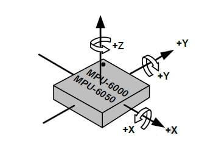
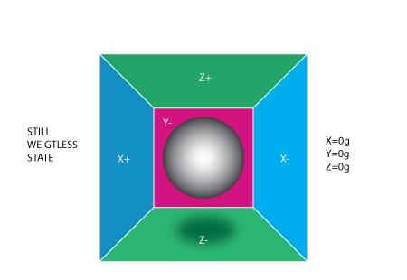
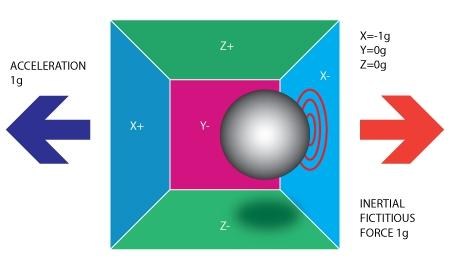
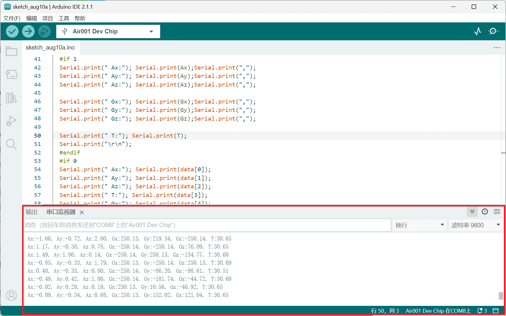

## 简介

本章介绍使用Air001开发板驱动MPU6050。

::: tip

MPU6050内部整合了三轴MEMS陀螺仪、三轴MEMS加速度计和一个内置温度传感器，可以读取三轴角度，三轴加速度以及当前温度。

:::

## 硬件准备

- 按[☁️ Air001开发板入门](/tutorial-advanced/Air001_start.html)，将`Air001`和`DAPLink调试器`使用排针排母连接。

- 将`MPU6050`模块与`Air001开发板`，按如下表格进行相连：

|   SHT30   | Air001 |
| :-------: | :----: |
|    GND    |  GND   |
|    VCC    |  3.3V  |
|    SCL    |  PF_1  |
| MOSI(DAT) |  PF_0  |

::: tip

剩余的`XDA`,`XCL`,`ADO`,`INT`引脚不用连接。

:::

::: details 关于MPU6050的方向

- 对于陀螺仪：令芯片表面(有文字的一面)朝上，将其表面文字转至正向自己，以芯片内部中心为原点，水平向右的为X轴正方向，水平指向外侧的为Y轴正方向，竖直向上的为Z轴正方向。



- 对于加速度计： 假想一个不受任何外力作用的球漂浮在正方体盒子中心，此时三轴加速度为0。当小球偏向任何一个方向时，为了保持静止，它自身将具有相反方向的加速度。





:::

## 软件部分

我们只需要使用Arduino自带的`Wire.h`库。

代码如下：

```cpp
#include<Wire.h>
//定义数组用于存放测量的三轴角度、三轴加速度和温度
int16_t data[7];
//MPU6050的总线地址是0x68
const int mpu_addr =0x68;
//依据加速度计和陀螺仪的量程设定精度
const uint16_t AccelScaleFactor = 16384;
const uint16_t GyroScaleFactor = 131;
```

::: tip

- 加速度计的范围有2g、4g、8g、16g可选。
- 陀螺仪的范围有±250、±500、±1000、±2000可选，而对应的精度分别是131LSB/(°/s)、65.5LSB/(°/s)、32.8LSB/(°/s)、16.4 LSB/(°/s)。

:::

定义`getData`函数来读取MPU6050测量的数据并依次赋给数组`data[]`。

```cpp
void getData(){
  //开启MPU6050的传输
  Wire.beginTransmission(mpu_addr);
  //寄存器的地址为0x3b
  Wire.write(0x3b);
  //结束传输
  Wire.endTransmission(false);
  //获取7个数据，每个两位
  Wire.requestFrom(mpu_addr,14,true);
  //赋值
  for(byte i=0;i<7;i++)
  {data[i]= Wire.read()<< 8| Wire.read();
  }
}
```

在`setup`函数中添加如下代码：

```cpp
void setup() {
  //设定SCL、SDA引脚
  Wire.setSCL(PF_1);
  Wire.setSDA(PF_0);
  //初始化
  Wire.begin();
  //陀螺仪
  Wire.beginTransmission(mpu_addr);
  Wire.write(0x6B);
  Wire.write(0);
  Wire.endTransmission(true);
  //加速度计
  Wire.beginTransmission(mpu_addr);
  Wire.write(0x1c);
  Wire.write(0x08);
  Wire.endTransmission(true);
  //初始化串口，用于输出日志
  Serial.begin(9600);
}
```

最后在`loop`函数中添加其余代码：

```cpp
void loop() {
  //声明双精度实型变量三轴加速度，温度，和三轴角度
  double Ax, Ay, Az, T, Gx, Gy, Gz;
  //引用之前定义的函数读取数据
  getData();
  //赋值
  Ax = (double)data[0]/AccelScaleFactor;
  Ay = (double)data[1]/AccelScaleFactor;
  Az = (double)data[2]/AccelScaleFactor;
  T = (double)data[3]/340+36.53;
  Gx = (double)data[4]/GyroScaleFactor;
  Gy = (double)data[5]/GyroScaleFactor;
  Gz = (double)data[6]/GyroScaleFactor;
  //输出三轴加速度
  Serial.print(" Ax:"); Serial.print(Ax);Serial.print(",");
  Serial.print(" Ay:"); Serial.print(Ay);Serial.print(",");
  Serial.print(" Az:"); Serial.print(Az);Serial.print(",");
  //输出三轴角度
  Serial.print(" Gx:"); Serial.print(Gx);Serial.print(",");
  Serial.print(" Gy:"); Serial.print(Gy);Serial.print(",");
  Serial.print(" Gz:"); Serial.print(Gz);Serial.print(",");
  //输出温度
  Serial.print(" T:"); Serial.print(T);
  //换行
  Serial.print("\r\n");
  //延时
  delay(50);
}
```

## 输出结果

在串口监视器中将波特率调至9600，可观察到当前状态和温度，如下图:


