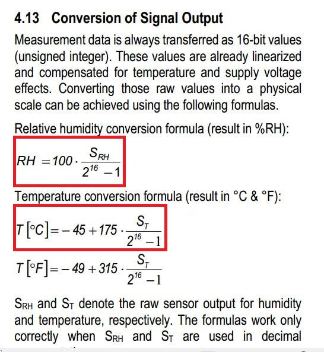
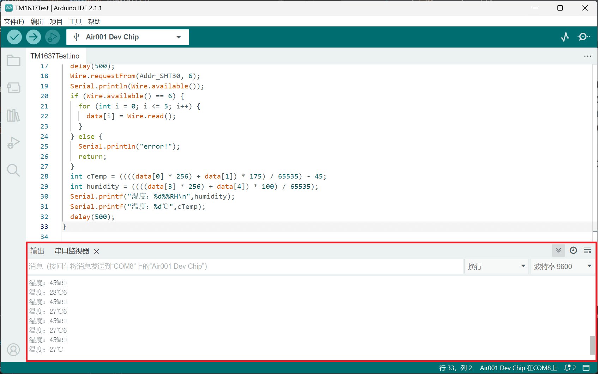

## 简介

本章介绍使用Air001开发板驱动SHT30。

::: tip

SHT30是一款使用I²C通信接口的温湿度传感器。

:::

## 硬件准备

- 按[☁️ Air001开发板入门](/tutorial-advanced/Air001_start.html)，将`Air001`和`DAPLink调试器`使用排针排母连接。

- 将`SHT30`模块与`Air001开发板`，按如下表格进行相连：

| SHT30 | Air001 |
| :---: | :----: |
|  GND  |  GND   |
|  VCC  |  3.3V  |
|  SCL  |  PF_1  |
|  SDA  |  PF_0  |

::: tip

I²C的`SCL`与`SDA`需要有上拉电阻，请确认外接的`SHT30`模块上有相应处理。

:::

## 软件部分

代码如下:

```cpp
#include <Wire.h>
//SHT30 I²C通信从机地址为0x44
#define Addr_SHT30 0x44
void setup() {
  //设定SCL和SDA引脚
  Wire.setSDA(PF_0);
  Wire.setSCL(PF_1);
  //初始化I²C
  Wire.begin();
  //设定波特率为9600
  Serial.begin(9600);
  //延时
  delay(300);
}

void loop() {
  //定义数组以存储获取的6个数据
  unsigned char data[6];
  //开始传输，设置I²C从机地址
  Wire.beginTransmission(Addr_SHT30);
  //发送测量命令0x2C06,由于一次只能发一个8位数据，因此分开发两次
  Wire.write(0x2C);
  Wire.write(0x06);
  //I²C停止
  Wire.endTransmission();
  //延时（等待测量数据）
  delay(500);
  //请求获取6字节的数据，传入对应的从机地址
  Wire.requestFrom(Addr_SHT30, 6);
  //判断是否成功读取到6个字节
  if (Wire.available() == 6) {
    //成功读取，则将数据存入data数组
    for (int i = 0; i <= 5; i++) {
      data[i] = Wire.read();
    }
  } else {
    //读取失败则打印"error!"
    Serial.println("error!");
    return;
  }
  //计算得到的数据将其转化为直观的温度和湿度，公式参考下方说明
  int cTemp = ((((data[0] * 256) + data[1]) * 175) / 65535) - 45;
  int humidity = ((((data[3] * 256) + data[4]) * 100) / 65535);
  //在串口里输出得到的数据
  Serial.printf("湿度：%d%%RH\n",humidity);
  Serial.printf("温度：%d℃",cTemp);
  //延时
  delay(500);
}
```

温湿度计算公式可以参考[官方文档](https://sensirion.com/media/documents/213E6A3B/63A5A569/Datasheet_SHT3x_DIS.pdf)：



## 输出结果

在串口监视器中将波特率调至9600，可观察到当前温湿度，如下图:


