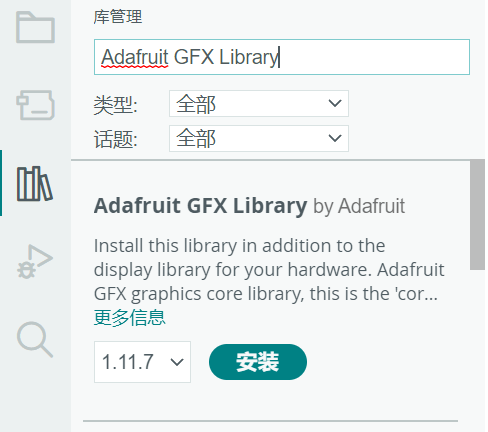
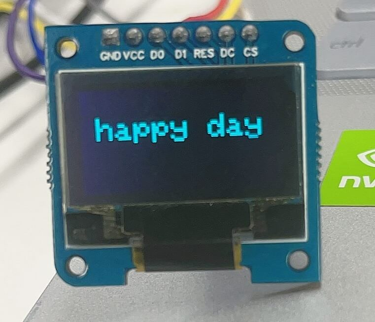

## 简介

本章介绍使用 Air001 开发板在 Arduino 平台上点亮SSD1306屏幕的使用方法。

## 硬件准备

Air001开发板一块、I²C接口的OLED屏幕（SSD1306驱动）一块。

按[☁️ Air001开发板入门](/tutorial-advanced/Air001_start.html)，将Air001和DAPLink调试器使用排针排母连接。

将`OLED屏幕`模块与`Air001开发板`，按如下表格进行相连：

| SSD1306 | air001  |
| :-----: | :-----: |
|   GND   |   GND   |
|   VCC   |  3.3V   |
| D0(SCL) |  PF01   |
| D1(SDA) |  PF00   |
|   RES   |   空    |
|   DC    | VCC/GND |
|   CS    |   GND   |

:::tip

`DC`连接可以决定I²C从机地址：

- `DC`连接`VCC`则I²C从机地址为`0x3d`
- `DC`连接`GND`则I²C从机地址为`0x3c`

:::

## 软件部分

首先，安装`Adafruit GFX Library`库与`Adafruit SSD1306`库。

:::details 打开Arduino管理库，进行安装

可以打开Arduino管理库，找到`Adafruit GFX Library`库和`Adafruit SSD1306`库并进行安装。



:::

首先引用这些库，并定义：

```cpp
#include <SPI.h>
#include <Wire.h>
#include <Adafruit_GFX.h>
#include <Adafruit_SSD1306.h>
#define SCREEN_WIDTH 128
#define SCREEN_HEIGHT 64
#define OLED_RESET     4
Adafruit_SSD1306 display(SCREEN_WIDTH, SCREEN_HEIGHT, &Wire, OLED_RESET);
```

- 定义 `SCREEN_WIDTH`(OLED显示宽度)，以像素为单位。
- 定义 `SCREEN_HEIGHT`(OLED显示高度)，以像素为单位。
- 初始化了一个SSD1306型号的显示器，使该显示器具`SCREEN_WIDTH`和`SCREEN_HEIGHT`指定的宽度和高度。

接着，在`setup()`函数中，添加如下代码：

```cpp
void setup() {
  Serial.begin(9600);
  if(!display.begin(SSD1306_SWITCHCAPVCC, 0x3C)) {
    Serial.println("SSD1306 allocation failed");
    while(1);
  }
  display.clearDisplay();
  ShowText();
}
```

- 初始化串口为`9600`波特率用于输出日志。
- 使用`display.begin`初始化屏幕设备，如果初始化失败，打印`SSD1306 allocation failed`，并阻塞代码。
- 使用`display.clearDisplay`清空屏幕信息。
- 调用`ShowText`函数，显示数据（函数见下方）。

接着声明`ShowText`函数，用于打印数据：

```cpp
void ShowText(void) {
  //清空屏幕信息
  display.clearDisplay();
  //设置文本字体大小为2
  display.setTextSize(2);
  //设置屏幕颜色为白色
  display.setTextColor(SSD1306_WHITE);
  //设置打印的起始坐标10,16
  display.setCursor(10, 16);
  //设置显示的文本信息
  display.println(F("happy day"));
  //将屏幕缓冲区数据刷到屏幕上，显示出来
  display.display();
}
```

最后加上`loop`函数，由于只是演示，所以这里我们用空函数实现：

```cpp
void loop() {}
```

## 输出结果

屏幕显示效果：


