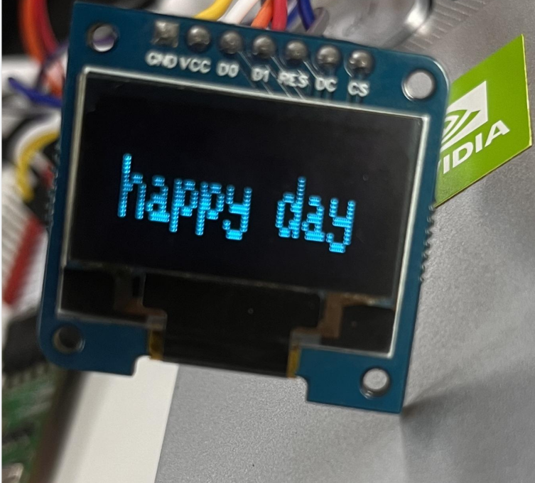

:::warning

本文档尚未进行review，可能存有不准确的描述内容。

:::

## 简介

  本章介绍使用 Air001 开发板在 Arduino 平台上点亮SSD1306屏幕的使用方法。

## 硬件准备

  Air001开发板一块,IIC屏幕（SSD1306）一块。
    接线如下：

| SSD1306 | air001 |
| :--: | :----: |
|GND|GND|
|VCC|3.3V|
|D0|PF01|
|D1|PF00|
|RES|RTS|
|DC|PB01|
|CS|PA04|

:::tip

   在Arduino管理库中找到`Adafruit_GFX`库和`Adafruit_SSD1306`库并且安装。

:::

## 软件部分

首先引用`Adafruit_GFX`库和`Adafruit_SSD1306`库
```cpp
#include <SPI.h>
#include <Wire.h>
#include <Adafruit_GFX.h>
#include <Adafruit_SSD1306.h>

#define SCREEN_WIDTH 128 
#define SCREEN_HEIGHT 32 
#define OLED_RESET     4 
Adafruit_SSD1306 display(SCREEN_WIDTH, SCREEN_HEIGHT, &Wire, OLED_RESET);

```

- 定义 `SCREEN_WIDTH`(OLED显示宽度)，以像素为单位.
- 定义 `SCREEN_HEIGHT`(OLED显示高度)，以像素为单位.
- 初始化了一个SSD1306型号的显示器，使该显示器具`SCREEN_WIDTH`和`SCREEN_HEIGHT`指定的宽度和高度。

接着，在`setup()`函数中，添加如下代码
```cpp
void setup() {
  Serial.begin(9600);
  if(!display.begin(SSD1306_SWITCHCAPVCC, 0x3C)) {
    Serial.println(F("SSD1306 allocation failed"));
    for(;;); 
  } 
  display.clearDisplay();
  ShowText();
}
```

- 初始化串口为`9600`波特率,如果初始化失败打印`SSD1306 allocation failed`.
- 进行循环，直到被中断或手动停止，清除显示器屏幕，显示文本信息。

最后，我们在`loop()`函数中添加剩下的代码。

```cpp
void loop() {
} 
void ShowText(void) {
  display.clearDisplay();
  display.setTextSize(2); 
  display.setTextColor(SSD1306_WHITE);
  display.setCursor(10, 10); //显示的坐标位置
  display.println(F("happy day"));
  display.display();      // Show text
}
```

- 定义一个名为`ShowText`函数来显示文本信息。
- 清除显示器，设置文本字体大小为`2`.
- 设置屏幕颜色为白色。
- 设置显示器起始坐标。
- 设置显示文本信息`happy day`,显示文本信息。

## 输出结果

屏幕显示效果；

