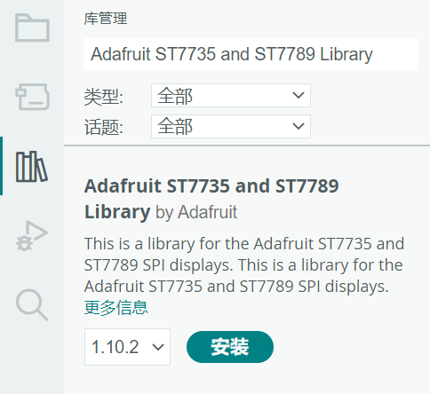
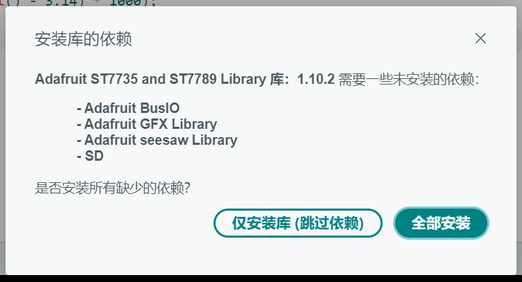
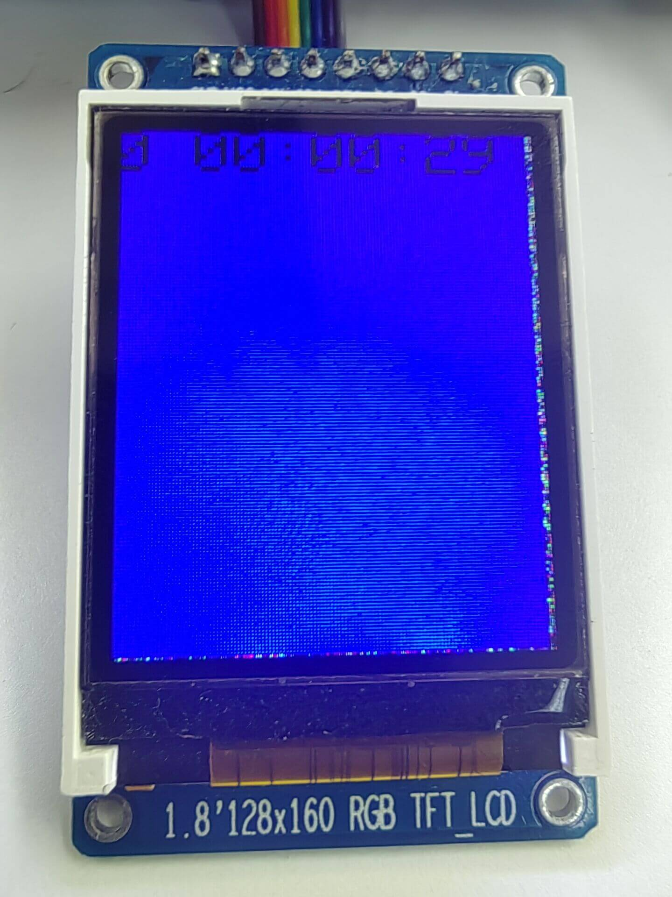
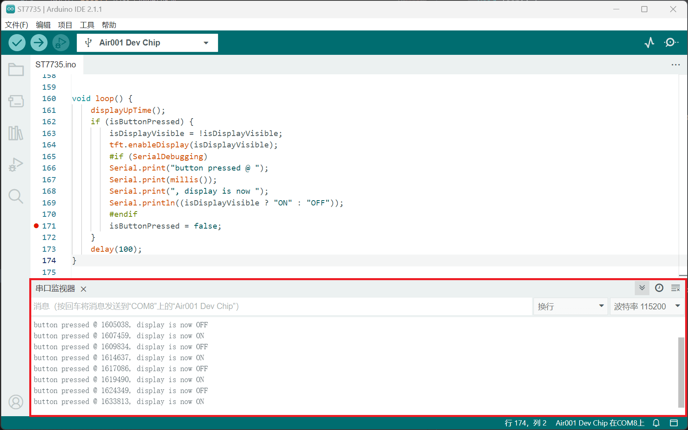

## 简介

本章介绍使用Air001开发板驱动ST7735。

::: tip

ST7735是一款具有SPI接口的彩色TFT液晶显示驱动芯片。

:::

## 硬件准备

- 按[☁️ Air001开发板入门](/tutorial-advanced/Air001_start.html)，将`Air001`和`DAPLink调试器`使用排针排母连接。

- 将`ST7735`模块与`Air001开发板`，按如下表格进行相连：

|   SHT30   | Air001 |
| :-------: | :----: |
|    GND    |  GND   |
|    VCC    |  3.3V  |
|    CLK    |  PA_5  |
| MOSI(DAT) |  PA_7  |
|    RES    |  PA_6  |
|    DC     |  PB_1  |
|    CS     |  PA_4  |
|    BL     |  PB_0  |

## 软件部分

在Arduino的库管理中搜索并安装`Adafruit ST7735 and ST7789 Library`，并选择`全部安装`以安装所需依赖。

:::details 打开Arduino管理库，进行安装





:::

首先引用这些库，并定义需要用的参数：

```cpp
#include <Adafruit_GFX.h>
#include <Adafruit_ST7735.h>
#include <SPI.h>

#define TFT_CS PA_4
#define TFT_RST PA_6
#define TFT_DC PB_1
#define TFT_MOSI PA_7
#define TFT_SCLK PA_5
#define SerialDebugging true

Adafruit_ST7735 tft = Adafruit_ST7735(TFT_CS, TFT_DC, TFT_MOSI, TFT_SCLK, TFT_RST);

const uint8_t Button_pin = PB_6;
```

- 开头我们用调用下载的`Adafruit_GFX.h`、`Adafruit_ST7735.h`包以及Arduino自带的`SPI.h`包。
- 依据Air001的接线，定义相关引脚。
- 实例化同时初始化`Adafruit_ST7735`的对象`tft`，后续仅需调用`tft`即可驱动`ST7735`。
- 将Air001开发板上的`BOOT`按钮对应的引脚`PB_6`定义为屏幕响应按键。

```cpp
const uint16_t Display_Color_Black = 0x0000; //黑
const uint16_t Display_Color_Blue = 0x001F;  //蓝

uint16_t Display_Text_Color = Display_Color_Black;
uint16_t Display_Backround_Color = Display_Color_Blue;
```

- 我们用`cosnt`定义颜色并防止其被更改。
- 定义文本颜色和背景颜色。

::: tip

可以使用(包括但不限于)如下代码定义其他颜色：

```cpp
const uint16_t Display_Color_Red = 0xF800;      //红
const uint16_t Display_Color_Cyan = 0x07FF;     //青
const uint16_t Display_Color_Green = 0x07E0;    //绿
const uint16_t Display_Color_White = 0xFFFF;    //白
const uint16_t Display_Color_Yellow = 0xFFE0;   //黄
const uint16_t Display_Color_Magenta = 0xF81F;  //粉
```

这里的颜色格式为`RGB565`，每个像素用16比特位表示，占2个字节，RGB分量分别使用5位、6位、5位。

:::

```cpp
const size_t MaxString = 32;
char oldTimeString[MaxString]           = { 0 };
```

- 定义字符串缓冲区大小。
- 初始空的字符串，用于显示。

我们在`setup()`函数中添加如下代码进行初始化操作。

```cpp
void setup() {
    //SerialDebugging在开头被定义为TRUE，这片宏定义区域生效
    #if (SerialDebugging)
    //初始化串口，用于输出日志
    Serial.begin(115200);
    while (!Serial);
    Serial.println();
    #endif
    delay(250);
    //初始化屏幕
    tft.initR(INITR_BLACKTAB);
    //初始化字体
    tft.setFont();
    //用蓝色填充屏幕
    tft.fillScreen(Display_Backround_Color);
    //设定文字颜色
    tft.setTextColor(Display_Text_Color);
    //设定文字大小
    tft.setTextSize(2);
}
```

定义`displayUpTime`函数，内容如下：

```cpp
void displayUpTime() {
    unsigned long upSeconds = millis() / 1000;
    unsigned long days = upSeconds / 86400;
    upSeconds = upSeconds % 86400;
    unsigned long hours = upSeconds / 3600;
    upSeconds = upSeconds % 3600;
    unsigned long minutes = upSeconds / 60;
    upSeconds = upSeconds % 60;
    char newTimeString[MaxString] = { 0 };
    sprintf(
        newTimeString,
        "%lu %02lu:%02lu:%02lu",
        days, hours, minutes, upSeconds
    );
    if (strcmp(newTimeString,oldTimeString) != 0) {
        tft.setCursor(0,0);
        tft.setTextColor(Display_Backround_Color);
        tft.print(oldTimeString);
        tft.setCursor(0,0);
        tft.setTextColor(Display_Text_Color);
        tft.print(newTimeString);
        strcpy(oldTimeString,newTimeString);
    }
}
```

- 计算显示的天数、小时、分钟、秒钟,将其显示并刷新(每次刷新消耗约2.5s)。

最后在`loop()`函数中添加代码。

```cpp
void loop() {
    //显示当前的时间
    displayUpTime();
    delay(100);
}
```

- 调用函数`displayUpTime`输出显示当前时间。
- 延时

## 输出结果

屏幕底色为蓝色，在最上方显示一行黑色的显示时长：



同时在串口监视器中将波特率调为115200可观察到如下字样：


