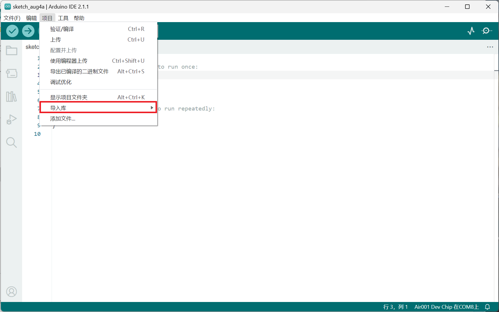
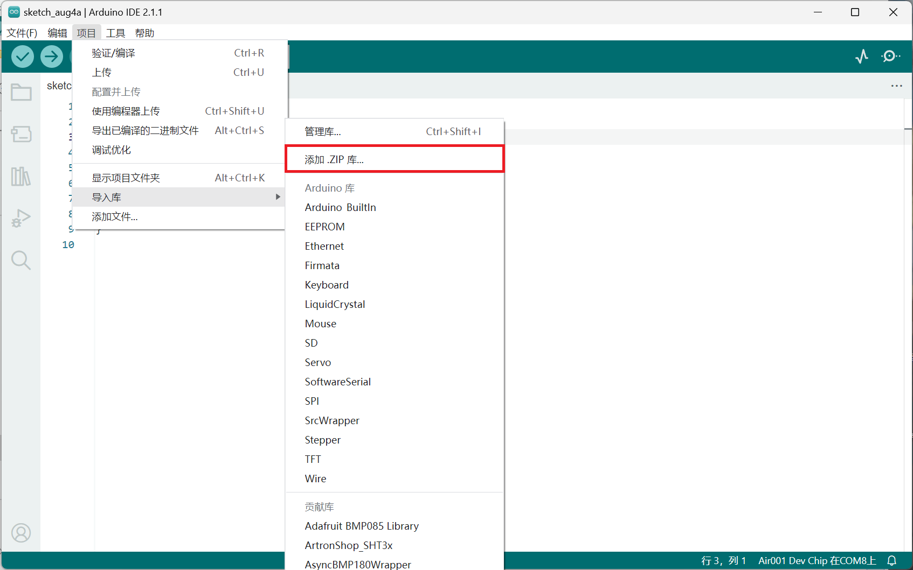

## 简介

* 本章介绍使用arduino通过烧录air001开发板驱动TM1637四位数码管模块
* TM1637LED数码管驱动芯片，是一种带键盘扫描接口的LED（发光二极管显示器）驱动控制专用电路

## 硬件准备

TM1637LED数码管驱动模块一块，air001开发板一块，接线示意如下:

| 3462BS-AB | air001 |
| :-------: | :----: |
|CLK|PA14|
|DIO|PA13|
|VCC|VBUS(5V)|
|GND|GND|

::: tip

注意：需将air001开发板与DAPLink调试器相连（可使用排针排母），详情请见[☁️ Air001开发板入门](/tutorial-advanced/Air001_start.html)

:::

## 软件部分

1. 按前文下载Arduino IDE、安装Air MCU，并选择接口和Air001 Dev Chip

2. 点击<https://github.com/Seeed-Studio/Grove_4Digital_Display/archive/master.zip>下载`TM1637.h`软件包，并添加到Arduino库中，添加方法如下

    1.点击上方菜单的`项目`选项

    

    2.点击菜单中的`导入库>`

    

    3.点击`添加.ZIP库…`

    

    4.选择前面下载的zip压缩文件，即可完成添加库

开头添加如下代码

```cpp
#include "TM1637.h"
#define CLK PA_14
#define DIO PA_13
int i;
TM1637 tm1637(CLK, DIO);
```

首先通过`#include`调用下载的`TM1637.h`软件包，并依据接线方法定义`CLK`和`DIO`连接在Air001开发板上的对应pin脚`PA_14`和`PA_13`
构造TM1637类的函数`tm1637(CLK, DIO)`,其中包含两个变量———CLK和DIO对应的pin脚

在`setup()`函数中添加如下代码

```cpp
void setup() {
    tm1637.init();
    tm1637.point(1);
    tm1637.set(BRIGHT_TYPICAL);
    }
```

在这里

1. 我们用`init`函数初始化`tm1637`
2. 用`point`函数控制四位数码管中间的冒号显示，并设置为1为打开（若设置为0则关闭）
3. 用`set`来调节数码管亮度，有0~7七个亮度等级，其中在`TM1637.h`软件包中`BRIGHT_TYPICAL`为经典亮度2，`BRIGHT_DARKEST`为最低亮度0，`BRIGHTEST`为最高亮度7

最后在`loop()`函数中添加代码

```cpp
void loop() {
    tm1637.display(0, 1);
    tm1637.display(1, 2);
    tm1637.display(2, 3);
    tm1637.display(3, 4);
}
```

用`display`函数中的前一个变量来控制位数，后一个变量来控制对应的显示

::: warning

位数从0开始，即第一位为0，第二位为1，依此类推，最后一位为3而非4！！

:::

## 输出结果

可观察到四位数码管显示12:34
