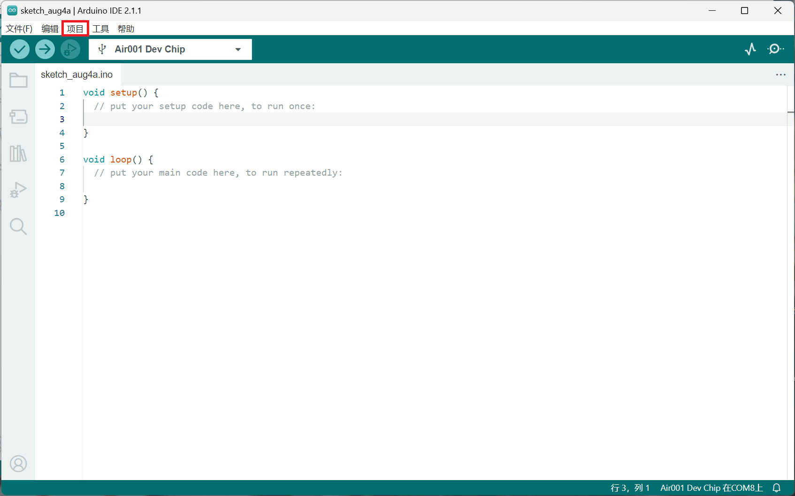

## 简介

本文将介绍使用 Air001 开发板驱动`TM1637`四位数码管模块。

:::tip

`TM1637`LED数码管驱动芯片，是一种带键盘扫描接口的LED数码管驱动控制专用电路。

:::

## 硬件准备

按[☁️ Air001开发板入门](/tutorial-advanced/Air001_start.html)，将`Air001`和`DAPLink调试器`使用排针排母连接。

将`TM1637LED数码管驱动模块`与`Air001开发板`，按如下表格进行相连：

| TM1637 |  Air001  |
| :----: | :------: |
|  CLK   |   PA14   |
|  DIO   |   PA13   |
|  VCC   | VBUS(5V) |
|  GND   |   GND    |

## 软件部分

我们需要使用[Grove_4Digital_Display](https://github.com/Seeed-Studio/Grove_4Digital_Display)库来驱动数码管模块，导入这个包到Arduino IDE中。

:::details 将库添加到Arduino IDE中

首先下载[Grove_4Digital_Display的ZIP包](https://github.com/Seeed-Studio/Grove_4Digital_Display/archive/master.zip)到本地目录。

点击Arduino IDE上方菜单的`项目`选项。



点击菜单中的`导入库>`。


点击`添加.ZIP库…`。


选择之前下载的zip压缩文件，即可完成添加库。

:::

开头添加如下代码。

```cpp
#include "TM1637.h"
#define CLK PA_14
#define DIO PA_13
int i;
TM1637 tm1637(CLK, DIO);
```

1. 首先通过`#include`调用下载的`TM1637.h`软件包。
1. 定义`CLK`和`DIO`的值，按照之前的接线方法，为Air001开发板上的对应pin脚`PA_14`和`PA_13`。
1. 初始化对象`tm1637`，传入刚刚定义的`CLK`和`DIO`，后续仅需调用`tm1637`对象即可操作数码管。

在`setup()`函数中添加如下代码进行初始化操作。

```cpp
void setup()
{
    tm1637.init();
    tm1637.point(1);
    tm1637.set(2);
}
```

1. 我们用`init`方法初始化`tm1637`。
2. 用`point`方法控制四位数码管中间的冒号显示，并设置为1为打开（若设置为0则关闭）。
3. 用`set`方法来调节数码管亮度，有`0~7`七个亮度等级，数字越大越亮。

最后在`loop()`函数中添加代码。

```cpp
void loop() 
{
    tm1637.display(0, 1);
    tm1637.display(1, 2);
    tm1637.display(2, 3);
    tm1637.display(3, 4);
}
```

用`display`方法，来更改某一位显示的值。

::: warning

位数从0开始，即第一位为0，第二位为1，依此类推。

:::

## 输出结果

可观察到四位数码管显示`12:34`。
