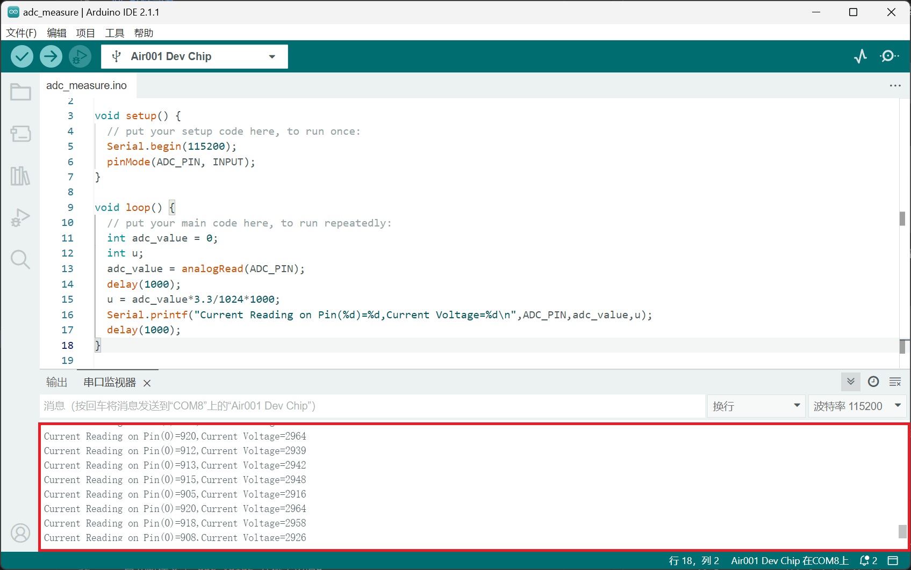

## 简介

本章介绍使用arduino烧录Air001开发板测量ADC

## 硬件准备

按[☁️ Air001开发板入门](/tutorial-advanced/Air001_start.html)，将Air001和DAPLink调试器使用排针排母连接

## 软件部分

按前文下载Arduino IDE、安装Air MCU，并选择接口和Air001 Dev Chip

开头添加代码定义ADC引脚`PA_0`

```cpp
#define ADC_PIN PA_0
```

在`setup()`函数中，添加如下代码

```cpp
void setup() {
  Serial.begin(115200);
  pinMode(ADC_PIN, INPUT);
}
```

使用`pinMode`函数初始化ADC引脚`PA_0`，并且设置为`INPUT`输入模式。

在`loop()`函数中添加其余代码

```cpp
void loop() {
  int adc_value = 0;
  adc_value = analogRead(ADC_PIN);
  delay(1000);
  Serial.printf("Current Reading on Pin(%d)=%d\n",ADC_PIN,adc_value);
  delay(1000);
}
```

- 首先新建变量`adc_value`并赋予初值0
- 然后用`analogRead`函数来读取ADC引脚`PA_0`的值并赋给`adc_value`
- 使用`delay(1000)`延时一秒
- 然后使用`prinf`函数打印出获得的引脚`PA_0`的值`adc_value`
- 使用`delay(1000)`延时一秒

## 输出结果

将波特率调为115200，在串口监视器中可观察到当前ADC的值(单位为mV)


