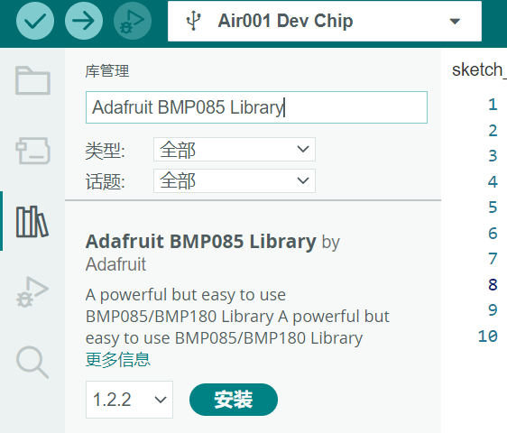

## 简介

本章介绍使用Air001开发板驱动 BMP180。

::: tip

BMP180 使用I²C通信接口，是专为测量大气压力而设计的基本传感器， BMP180可以测量300至1100 hPa（海拔9000m至-500m）的大气压，以及-40°C至85°C的温度。

:::

## 硬件准备

- 按[☁️ Air001开发板入门](/tutorial-advanced/Air001_start.html)，将`Air001`和`DAPLink调试器`使用排针排母连接。

- 将`BMP180`模块与`Air001开发板`，按如下表格进行相连：

| BMP180 | Air001 |
| :---: | :----: |
|  GND  |  GND   |
|  VCC  |  3.3V  |
|  SCL  |  PF_1  |
|  SDA  |  PF_0  |

## 软件部分

首先，安装`Adafruit BMP085 Library`库。

:::details 打开Arduino管理库，进行安装

可以打开Arduino管理库，找到`Adafruit BMP085 Library`库，并选择`全部安装`以安装所需依赖。



:::

开头引用`Adafruit_BMP085`包，并实例化对象`bmp`，后续仅需调用`bmp`对象即可使用BMP180，

```cpp
#include <Adafruit_BMP085.h>
Adafruit_BMP085 bmp;
```

在`setup()`函数中初始化串口与BMP180：

```cpp
void setup() {
  Serial.begin(9600);//初始化串口，波特率9600
  if (!bmp.begin()) {//初始化设备
    Serial.println("initial failed");
    while (1);
  }
}
```

在`loop()`函数中添加如下代码：

```cpp
void loop() {
  Serial.print("温度");
  Serial.print(bmp.readTemperature());
  Serial.println("℃");

  Serial.print("气压");
  Serial.print(bmp.readPressure());
  Serial.println("Pa");

  // 粗略计算海拔高度
  Serial.print("海拔");
  Serial.print(bmp.readAltitude());
  Serial.println("米");

  Serial.println();
  delay(500);
}
```

- 使用`bmp.readTemperature`方法，获取当前温度。
- 使用`bmp.readPressure`方法，获取当前气压。
- 使用`bmp.readAltitude()`方法，粗略计算当前的海拔高度。

## 输出结果

在串口监视器中将波特率调至9600，可观察到当前的信息，如下图：


