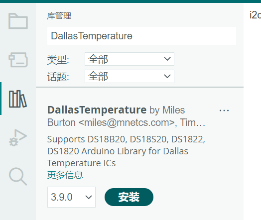
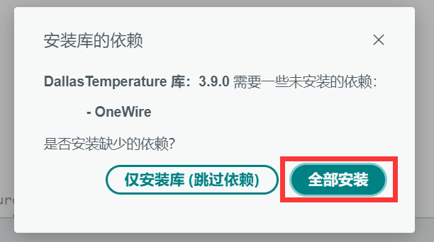
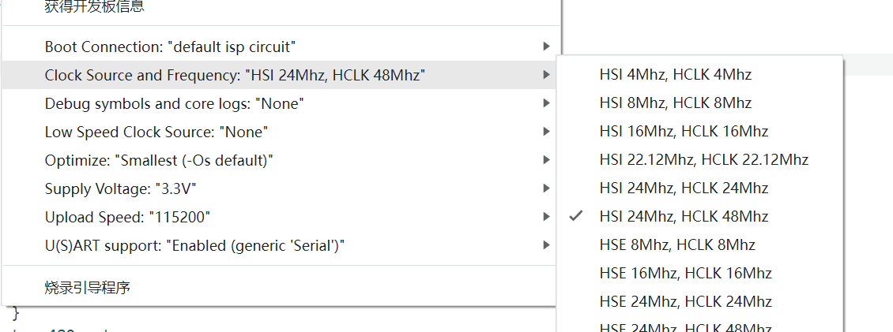

## 简介

本章介绍使用Air001开发板驱动 DS18B20。

::: tip

DS18B20 是数字温度传感器，使用1Wire(单总线)通信接口，只需要一条数据线 (和地线) 即可与处理器进行数据传输。  
器件可以工作在-55°C至+125°C范围，在-10°C至+85°C范围内测量精度为±0.5°C。  
每个DS18B20具有唯一的64位序列号，从而允许多个DS18B20挂接在同一条1-Wire总线。

:::

## 硬件准备

- 按[☁️ Air001开发板入门](/tutorial-advanced/Air001_start.html)，将`Air001`和`DAPLink调试器`使用排针排母连接。

- 将`DS18B20`模块与`Air001开发板`，按如下表格进行相连：

| DS18B20 | Air001 |
| :-----: | :----: |
|   GND   |  GND   |
|   VCC   |  3.3V  |
|   DQ    |  PA_5  |

::: warning

如果你是直接连接的`DS18B20`元器件，你需要为`DQ`进行上拉操作。  
（比如在`VCC`与`DQ`之间连接一颗`4.7K电阻`）

:::

## 软件部分

首先，安装`DallasTemperature`库，并选择`全部安装`以安装所需依赖。

:::details 打开Arduino管理库，进行安装

可以打开Arduino管理库，找到`Adafruit DallasTemperature Library`库，并选择`全部安装`以安装所需依赖。





:::

为了保证单总线的时序保持正常，我们需要将芯片主频设置为最高的 48M。

:::details 在Arduino中设置芯片主频



:::

开头引用`OneWire`包与`DallasTemperature`包，并实例化对象`sensors`，后续仅需调用`sensors`对象即可使用DS18B20。

```cpp
// 引用必要的库
#include <OneWire.h>
#include <DallasTemperature.h>

// 初始化一个单总线对象，设置使用PA_5引脚进行通信
OneWire oneWire(PA_5);
// 初始化一个传感器对象，使用刚新建的单总线对象
DallasTemperature sensors(&oneWire);
```

在`setup()`函数中初始化串口与`sensors`对象：

```cpp
void setup() {
  //初始化串口
  Serial.begin(9600);
  //初始化传感器库
  sensors.begin();
}
```

在`loop()`函数中添加如下代码：

```cpp
void loop() {
  Serial.print("开始获取温度信息...");
  sensors.requestTemperatures();  //发出获取温度的请求
  Serial.println("获取完成");
  // 我们只取第一个传感器的温度信息
  float tempC = sensors.getTempCByIndex(0);

  //检查一下是不是真的获取成功了
  if (tempC != DEVICE_DISCONNECTED_C) {
    Serial.print("获取到的温度为：");
    Serial.print(tempC);
    Serial.println("℃");
  } else {
    Serial.println("数据读取失败！");
    delay(500);
  }
  Serial.println();
}
```

- 使用`sensors.requestTemperatures`方法，尝试获取温度。
- 使用`sensors.getTempCByIndex`方法，获取到第一个设备的温度值。
- 如果成功获取，将温度值打印出来

## 输出结果

在串口监视器中将波特率调至9600，可观察到当前的信息，如下：

```log
开始获取温度信息...获取完成
获取到的温度为：27.19℃

开始获取温度信息...获取完成
获取到的温度为：27.25℃

开始获取温度信息...获取完成
获取到的温度为：27.19℃

开始获取温度信息...获取完成
获取到的温度为：27.25℃

开始获取温度信息...获取完成
获取到的温度为：27.19℃

开始获取温度信息...
```
