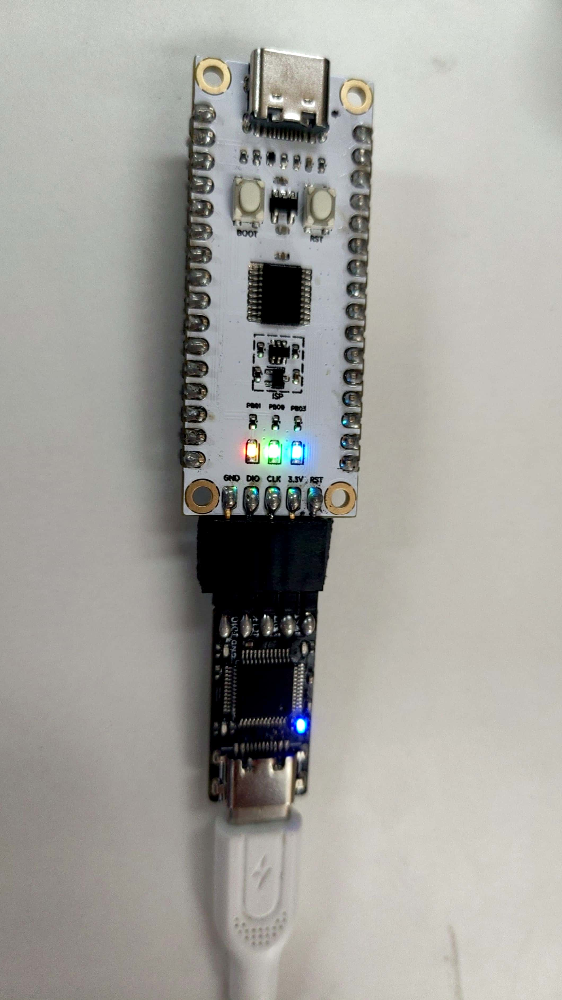

# 💡 点灯

## 简介

本章介绍使用arduino烧录Air001开发板控制其上3个LED灯闪烁

## 硬件准备

按前文“☁️ Air001开发板入门”将Air001和DAPLink调试器使用排针排母连接

## 软件部分

:::tip

按前文下载Arduino IDE、安装Air MCU，并选择接口和Air001 Dev Chip

:::

代码如下

```cpp
void setup() {
  // put your setup code here, to run once:
  pinMode(PB_1, OUTPUT);
  pinMode(PB_0, OUTPUT);
  pinMode(PB_3, OUTPUT);
  Serial.begin(115200);
  Serial.printf("Hello, Air001. \n");
}

void loop() {
  // put your main code here, to run repeatedly:
  static int count = 0;
  if (count % 2 == 0) {
    digitalWrite(PB_1, HIGH);
    digitalWrite(PB_0, HIGH);
    digitalWrite(PB_3, HIGH);
  } else {
    digitalWrite(PB_1, LOW);
    digitalWrite(PB_0, LOW);
    digitalWrite(PB_3, LOW);
  }
  Serial.printf("This is NO.%d print. \n", count);
  count++;
  delay(1000);
}
```

1. 在setup()函数中引用pinMode(pin, mode)来设置pin脚对应Arduino数字门的模式，只用于数字门定义是输入INPUT还是输出OUTPUT
2. 在loop()函数中引用digitalWrite(pin, mode)来在当引脚pin在pinMode0的中被设置为OUTPUT模式时，使其电压将被设置为相应的值，HIGH为3.3V，LOW为OV。当给3个引脚3.3V的高电平时，各引脚上连接的LED就会被点亮，而给引脚0V的低电平时，LED熄灭

:::tip

Air001上的3个LED对应的pin引脚可参考<https://wiki.luatos.com/chips/air001/board.html>

:::

## 输出结果

在串口监视器中可以观察到"This is NO.xxx print."的字样，且3个LED灯常亮，如下图


