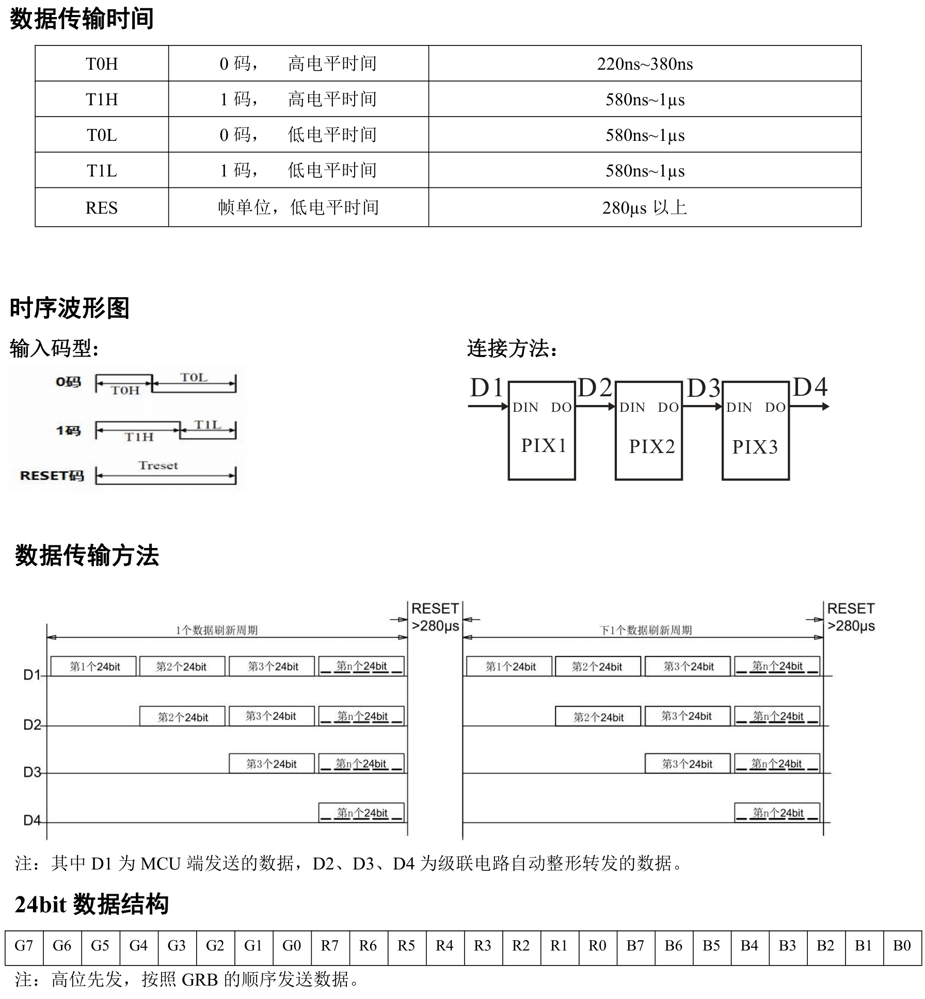
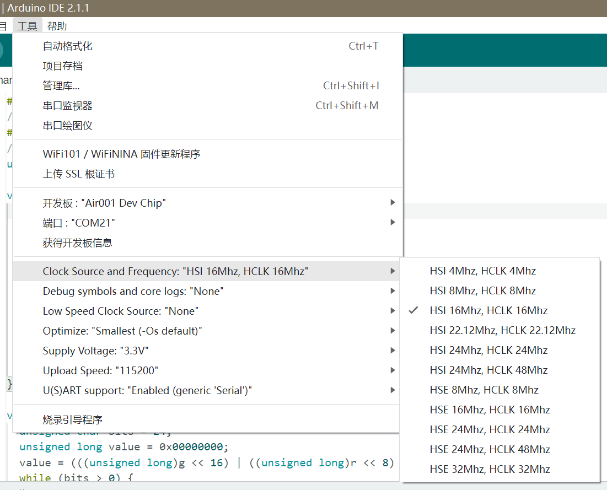
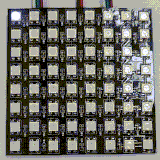

## 简介

本章介绍使用Air001开发板驱动 WS2812 灯。

::: tip

[WS2812 是一个三色 LED 驱动芯片](http://world-semi.com/ws2812-family/)，一般集成在 LED 灯珠中。  
它仅需一个 IO 传输数据，可通过多个 LED 串联传递信号，实现批量控制。

:::

## 硬件准备

- 按[☁️ Air001开发板入门](/tutorial-advanced/Air001_start.html)，将`Air001`和`DAPLink调试器`使用排针排母连接。

- 将`Air001开发板`的 USB 插入一根数据线，用向灯板提供 5V 电压。

- 将`WS2812`LED 模块与`Air001开发板`，按如下表格进行相连：

| WS2812 模块 |  Air001  |
| :---------: | :------: |
|     GND     |   GND    |
|     VCC     | VBUS(5V) |
|     DIN     |   PA_7   |

::: tip

由于 WS2812 的时序要求相对严格，我们将使用 SPI 的 MOSI 引脚（PA_7）对其进行驱动。

:::

## 软件部分

查阅资料，我们可以得知`WS2812`需要严格的时序，我们将参考[此处](https://github.com/452/arduino-ws2812-direct-spi-control)的代码，使用 SPI 进行驱动。

:::details WS2812 的控制时序，此处不作深入讲解



:::

首先，**为了保证 SPI 频率在 8MHz，我们需要将芯片的主频设置为 16M**，这样只要设置 SPI 二分频即可实现输出为 8MHz。

:::details 在Arduino中设置芯片主频



:::

我们在代码开头，引用库与定义需要使用的全局量：

```cpp
#include<SPI.h>
//LED灯的个数
#define LED_N   64
//用于存储当前LED灯的状态，默认全为(0,0,0)不亮
unsigned char LED_T[LED_N][3] = {0};
```

这里的`LED_T`用于存储当前的LED灯颜色数据，可以在刷新时一次性将所有状态全部发给`WS2812`。

在`setup`初始化函数中，我们初始化一下`SPI`，并将灯的状态初始化（全部熄灭）：

```cpp
void setup (void) {
  //初始化SPI
  SPI.begin();
  SPI.setBitOrder(MSBFIRST);
  SPI.setDataMode(SPI_MODE1);
  // 这里需要让SPI处于8MHz
  // 所以芯片要设置16M，SPI配置为2分频：
  // 16/2=8MHz
  SPI.setClockDivider(SPI_CLOCK_DIV2);
  delay(10);
  //刷新一下所有灯的状态，函数见文档接下来的内容
  WS2812_refresh();
}
```

这里的重点是`SPI.setClockDivider`函数，它设置了 SPI 频率在 8MHz。  
`SPI.setBitOrder`和`SPI.setDataMode`的配置，也保证了后续模拟时序的正确性。

接下来是真正模拟`WS2812`时序的函数，这个函数传入 RGB 值，转换为信号进行发送：

```cpp
void WS2812_send(unsigned char r, unsigned char g, unsigned char b) {
  unsigned char bits = 24;
  unsigned long value = 0x00000000;
  value = (((unsigned long)g << 16) | ((unsigned long)r << 8) | ((unsigned long)b));
  while (bits > 0) {
    if ((value & 0x800000) != LOW) {
      SPI.transfer(0xF8);//1
      asm("nop");
      asm("nop");
    } else {
      SPI.transfer(0xC0);//0
    }
    value <<= 1;
    bits--;
  }
}
```

由于`WS2812`灯珠是串在一起进行通信的，当需要控制所有灯珠时，只要将颜色数据一个个发送出去就可以了。  
所以`WS2812_refresh`刷新函数就像下面这样，依次发送颜色数据：

```cpp
void WS2812_refresh() {
  unsigned int n = 0;
  for (n = 0; n < LED_N; n++) {
    WS2812_send(LED_T[n][0], LED_T[n][1], LED_T[n][2]);
  }
  delayMicroseconds(60);
}
```

最后我们在`loop`函数中，简单写一个按顺序亮灯的小功能：

```cpp
int count = 0;
void loop(void) {
  count++;
  //把上一次亮的灯灭了
  LED_T[(count-1)%LED_N][0] = 0;
  LED_T[(count-1)%LED_N][1] = 0;
  LED_T[(count-1)%LED_N][2] = 0;
  //电亮这次的这个灯
  //来个浅蓝色吧
  //亮度低一点，不然刺眼
  LED_T[count%LED_N][0] = 5; //R
  LED_T[count%LED_N][1] = 5; //G
  LED_T[count%LED_N][2] = 20;//B
  //刷新所有灯的状态
  WS2812_refresh();
  //延时一小会
  delay(10);
}
```

## 输出结果

可以看到，灯会按顺序闪烁：


